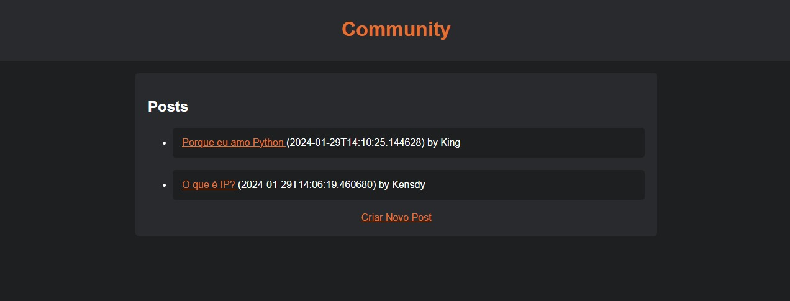
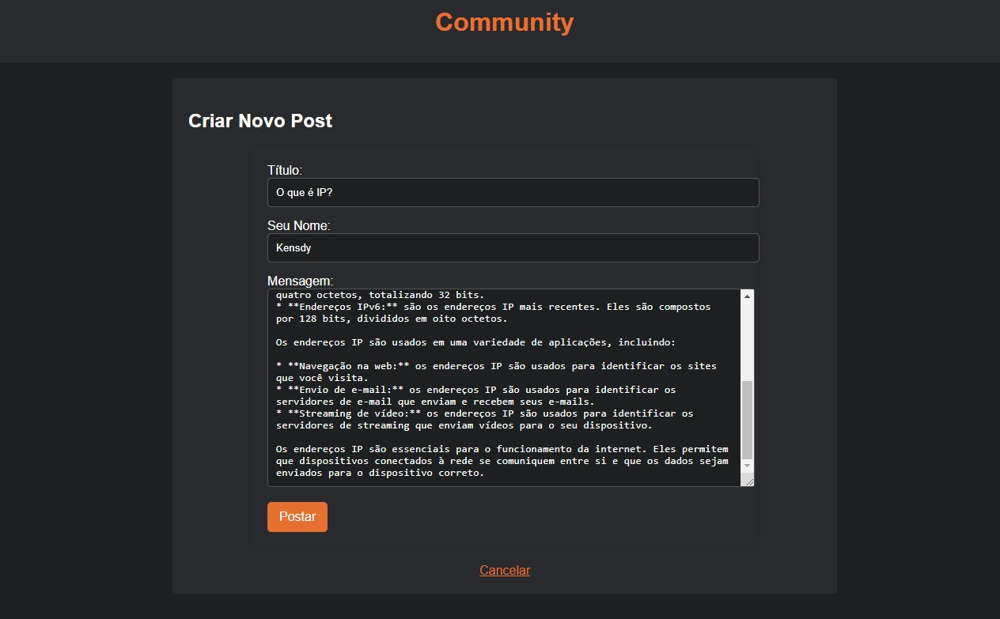
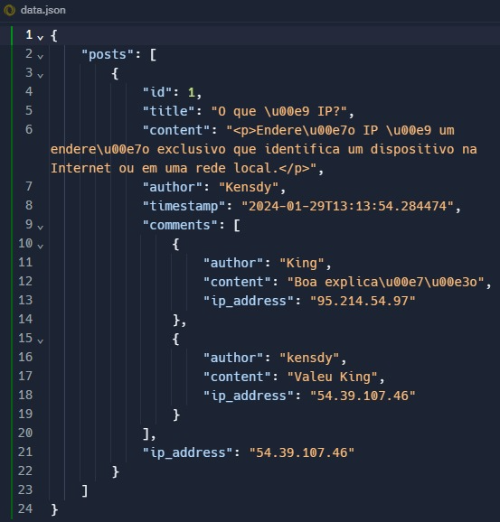
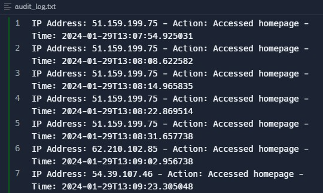

# Community-V3

The Community is a Flask-based forum template designed to facilitate online discussions in a simple and open manner. This open-source project provides an accessible and customizable framework to meet the diverse needs of online communities.

[Português](README_pt.md) | English

[](https://github.com/kensdy/Community-V3)

## How to Use

1. **Prerequisites:**
   - Ensure that you have Python installed on your machine.

2. **Cloning the Repository:**
   - Run the following command to clone the repository:
     ```bash
     git clone https://github.com/kensdy/Community-V3
     ```
3. **Running the Application:**
   - Navigate to the newly cloned directory with `cd Community-V3`.
   - Install dependencies using `pip install -r requirements.txt`.
   - Run `python main.py` to start the local server.
   - Access `http://127.0.0.1:5000` in your browser to interact with the forum.

## Video Tutorial

Check out this video tutorial demonstrating the installation and providing an overview of Community-V3. Although based on version 1, many concepts still apply, and the tutorial offers valuable insights into the system's operation.

[](https://www.youtube.com/watch?v=j09MK7o5NCU)

This video includes:

- Step-by-step instructions for installing and running Community-V3.
- A brief demonstration of key features.

Ensure to adjust the information as needed, considering the differences between versions, and leverage the tutorial to explore Community-V3's functionalities.

## **Understanding the Features**

The Community offers various features to provide a robust and user-friendly experience:

### 1. Home Page

The Home Page displays a list of all posts created on the site, organized with the most recent at the top. This is the entry point for the community, providing a comprehensive view of ongoing discussions.


### 2. Post Creation Page

On the Post Creation Page, users can contribute to the community by sharing their ideas, experiences, or questions. Simply provide a title, a nickname (nick), and the desired content. Markdown formatting is supported to enhance the content.


### 3. Post Reading Page

The Post Reading Page allows users to access specific posts for more detailed reading. Additionally, on this page, it is possible to interact with the content by leaving comments on existing posts. This promotes a dynamic discussion experience, allowing the community to actively engage in presented topics.


### 4. Post and Comment System

The post and comment system is the backbone of the Community, providing a platform to share ideas and express opinions. Users can interact easily and intuitively, fostering dynamic discussions.

### 5. No Login Required

No login is required to interact with the Community. This approach simplifies access, enabling users to quickly join discussions without the need to create an account.

### 6. JSON File-Based Database System

The Community uses a JSON file-based storage system, specifically in the 'data.json' file, to manage both posts and comments. This choice was made for simplicity and ease of customization, eliminating the need for a more complex database.

In the `data.json` file, the post database is stored, providing essential management features for the online community. This file not only contains information about the posts but also offers additional features:

1. **Unique Identifiers:** Each post has a unique identifier (`id`), allowing for easy and unique references.

2. **Post Details:**
   - Title (`title`): The title of the post.
   - Content (`content`): The content of the post.
   - Author (`author`): The author of the post.
   - Timestamp (`timestamp`): The date and time of the post.

3. **Attached Comments:**
   - Each post can have a list of comments associated with it, providing an interactive and dynamic experience.

4. **IP Tracking:**
   - The `data.json` file also includes the IP address (`ip_address`) of the post author, providing additional information for analysis and management.

This structure in `data.json` enables effective and customized management of posts and comments, offering a solid foundation for building and maintaining a vibrant online community.

#### 1. **Deleting Posts:**
   - Through the `data.json` file, it is possible to delete posts as needed. Simply locate the corresponding entry and remove it from the file to perform the deletion.
     
   

#### 2. **Additional Information:**
   - The file also includes additional details about the posts, such as the IP of the user who created them. This provides a more comprehensive view of user activities.

   ```json
{
  "posts": [
    {
      "id": 1,
      "title": "Post Title",
      "content": "Post Content",
      "author": "Author Name",
      "timestamp": "Date and time",
      "comments": [
        {
          "author": "Commenter Name",
          "content": "Comment Content",
          "ip_address": "248.161.103.175"
        }
      ],
      "ip_address": "142.57.70.192"
    }
  ]
}
   ```

#### 3. **IP Tracking:**
   - The `ip_address` field in each entry allows tracking the IP of the post author, offering an additional layer of information about the origin of interactions on your site.

Utilize these features as needed to manage and analyze posts on your forum, ensuring effective control over content and providing additional insights into user activity.

### 7. Site Access Logs System

The Community features an auditing functionality through the `audit_log.txt` file. This file meticulously records all accesses to the site, including crucial information such as the user's IP address and access time. This feature provides a comprehensive view

of interactions with your site, allowing you to monitor and analyze traffic accurately.

#### How to Use

1. **File Location:**
   - Open the `audit_log.txt` file in the project directory.
     
     

2. **Record Content:**
   - Each line of the file represents a log entry, displaying the user's IP and access time.
     ```plaintext
     IP Access: xxx.xxx.xxx.xxx - [Date and Time]
     ```

3. **Access Analysis:**
   - Use this log to track access patterns, identify suspicious activities, or simply monitor the frequency of visits to your site.

### 8. IP Ban System

The Community incorporates an IP banning feature to enhance security and community management. This functionality allows blocking access from specific IPs, automatically redirecting them to a blocking page (`blocked.html`) when attempting to access the site.

To restrict access from specific IPs to the site, you can use the `blocked_ips.json` file. Follow the steps below:

1. **Locate the `blocked_ips.json` File:**
   - Open the `blocked_ips.json` file

 in the project directory.

2. **Adding Blocked IPs:**
   - Insert the IPs you want to block in JSON format. For example:
     ```json
     ["248.161.103.175", "142.57.70.192"]
     ```
     This will block access from the listed IPs.
     
     

3. **Redirect to the Blocking Page:**
   - When a user with a blocked IP attempts to access the site, they will be automatically redirected to the blocking page (`blocked.html`).
    

> **Note:** Ensure to customize the `blocked.html` page as needed to provide appropriate information to blocked users.

This ensures efficient control over site access, allowing you to restrict specific IPs and offer a personalized redirection experience for those who are blocked.

## **Community License**

This project is distributed under the terms of the [MIT License](LICENSE). By using or contributing to the Community, you agree to the following terms:

1. **Recognition:**
   - The use of this project requires you to provide proper credits to the creator, "Kensdy." When displaying or referencing this project in your work, include appropriate attribution with a link to [Kensdy's GitHub](https://github.com/kensdy).

2. **Modifications and Derivatives:**
   - If you modify or create a derivative work of this project, you can distribute the resulting work only under the terms of this license or a license similar to MIT.

3. **Disclaimer of Warranties:**
   - This project is provided "as is," without warranties of any kind, express or implied. Contributors or the creator are not responsible for any damages or liabilities resulting from the use or misuse of this project.

By using the Community, you agree to follow these terms and acknowledge the credits to the creator. The MIT License aims to promote collaboration and the sharing of open-source code.
