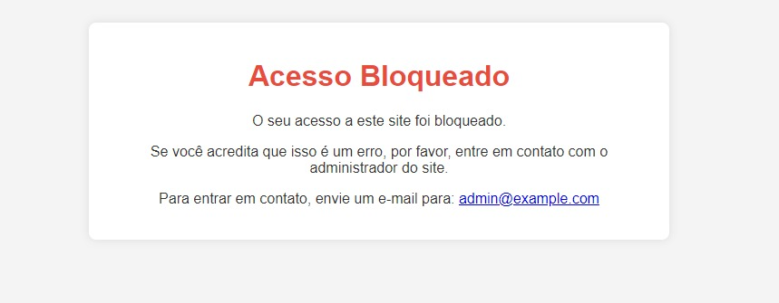

# Community-V3

### Bloqueio de Acesso por IP

Para restringir o acesso de determinados IPs ao site, você pode utilizar o arquivo `blocked_ips.json`. Siga os passos abaixo:

1. **Localize o Arquivo `blocked_ips.json`:**
   - Abra o arquivo `blocked_ips.json` no diretório do projeto.

2. **Adicionando IPs Bloqueados:**
   - Insira os IPs que você deseja bloquear no formato JSON. Por exemplo:
     ```json
     ["248.161.103.175", "142.57.70.192"]
     ```
     Isso bloqueará o acesso dos IPs listados.
     

3. **Redirecionamento para a Página de Bloqueio:**
   - Quando um usuário com IP bloqueado tenta acessar o site, será automaticamente redirecionado para a página de bloqueio (`blocked.html`).
    

> **Nota:** Certifique-se de ajustar a página `blocked.html` conforme necessário para fornecer informações adequadas aos usuários bloqueados.

Isso garante um controle eficiente sobre o acesso ao site, permitindo que você restrinja específicos IPs e ofereça uma experiência de redirecionamento personalizada para aqueles que estão bloqueados.

Certamente, aqui está uma melhoria para essa seção:

### Registro de Auditoria

No arquivo `audit_log.txt`, você pode encontrar um registro detalhado de todos os acessos ao site, incluindo informações cruciais como o endereço IP e o horário de acesso. Esta funcionalidade proporciona uma visão abrangente das interações com o seu site, permitindo monitorar e analisar o tráfego com precisão.

#### Como Utilizar

1. **Localização do Arquivo:**
   - Abra o arquivo `audit_log.txt` no diretório do projeto.

2. **Conteúdo do Registro:**
   - Cada linha do arquivo representa uma entrada de registro, exibindo o IP do usuário e o horário de acesso.

     ```plaintext
     Acesso do IP: xxx.xxx.xxx.xxx - [Data e Hora]
     ```

3. **Análise de Acessos:**
   - Utilize esse registro para rastrear padrões de acesso, identificar atividades suspeitas ou simplesmente monitorar a frequência de visitas ao seu site.
