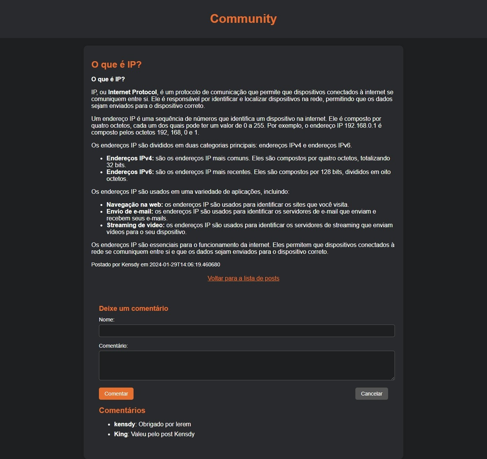

# Community-V3

O Community é um modelo de fórum desenvolvido em Flask, projetado para facilitar discussões online de maneira simples e aberta. Este projeto open source oferece uma estrutura acessível e personalizável para atender às diversas necessidades de comunidades online.

Português | [English](README.md)

[](https://github.com/kensdy/Community-V3)

## Como Usar

1. **Pré-requisitos:**
   - Certifique-se de ter o Python instalado em sua máquina.

2. **Clonando o Repositório:**
   - Execute o seguinte comando para clonar o repositório:
     ```bash
     git clone https://github.com/kensdy/Community-V3
     ```
3. **Executando o Aplicativo:**
   - Navegue para o diretório recém-clonado com `cd Community-V3`.
   - Instale as dependências usando `pip install -r requirements.txt`.
   - Execute `python main.py` para iniciar o servidor local.
   - Acesse `http://127.0.0.1:5000` em seu navegador para interagir com o fórum.
  
## Tutorial em Vídeo

Confira este vídeo tutorial que demonstra a instalação e apresenta uma visão geral do Community-V3. Apesar de ser baseado na versão 1, muitos conceitos ainda se aplicam e o tutorial fornece insights úteis sobre o funcionamento do sistema.

[](https://www.youtube.com/watch?v=j09MK7o5NCU)

Este vídeo inclui:

- Instruções passo a passo para instalar e executar o Community-V1.
- Uma breve demonstração das funcionalidades principais.

Certifique-se de ajustar as informações conforme necessário, considerando as diferenças entre as versões, e aproveite o tutorial para explorar as funcionalidades do Community-V3.

## **Conhecendo as Funcionalidades**

O Community apresenta diversas funcionalidades que visam proporcionar uma experiência robusta e amigável para os usuários:

### 1. Página Inicial (Home)

A Página Inicial exibe uma lista de todos os posts já criados no site, organizados com os mais recentes no topo da lista. Esta é a porta de entrada para a comunidade, proporcionando uma visão abrangente das discussões em andamento.


### 2. Página de Criação de Posts

Na Página de Criação de Posts, os usuários podem contribuir para a comunidade compartilhando suas ideias, experiências ou perguntas. Basta fornecer um título, um apelido (nick), e o conteúdo desejado. A formatação utilizando markdown é suportada para enriquecer o conteúdo.


### 3. Página de Leitura de Posts

A Página de Leitura de Posts permite que os usuários acessem postagens específicas para leitura mais detalhada. Além disso, nesta página, é possível interagir com o conteúdo, deixando comentários nas postagens existentes. Isso promove uma experiência dinâmica de discussão, permitindo que a comunidade se envolva ativamente nos tópicos apresentados.


### 4. Sistema de Posts e Comentários

O sistema de posts e comentários é a espinha dorsal do Community, proporcionando uma plataforma para compartilhar ideias e expressar opiniões. Os usuários podem interagir de maneira fácil e intuitiva, estimulando discussões dinâmicas.

### 5. Sem Necessidade de Login

Não é necessário realizar login para interagir com o Community. Essa abordagem simplifica o acesso, permitindo que os usuários participem rapidamente das discussões sem a necessidade de criar uma conta.

### 6. Sistema de Banco de Dados em Arquivo JSON

O Community utiliza um sistema de armazenamento em arquivo JSON, especificamente no arquivo 'data.json', para gerenciar tanto os posts quanto os comentários. Essa escolha foi feita visando simplicidade e facilidade de personalização, eliminando a necessidade de um banco de dados mais complexo.

No arquivo `data.json`, a base de dados de posts é armazenada, proporcionando funcionalidades de gerenciamento essenciais para a comunidade online. Este arquivo não apenas contém informações sobre as postagens, mas também oferece recursos adicionais:

1. **Identificadores Únicos:** Cada post possui um identificador único (`id`), permitindo uma referência fácil e única.

2. **Detalhes dos Posts:**
   - Título (`title`): O título da postagem.
   - Conteúdo (`content`): O conteúdo da postagem.
   - Autor (`author`): O autor da postagem.
   - Timestamp (`timestamp`): A data e hora da postagem.

3. **Comentários Anexados:**
   - Cada post pode ter uma lista de comentários associados a ele, fornecendo uma experiência interativa e dinâmica.

4. **Rastreamento de IP:**
   - O arquivo `data.json` também inclui o endereço IP (`ip_address`) do autor da postagem, fornecendo informações adicionais para a análise e gerenciamento.

Essa estrutura no `data.json` possibilita um gerenciamento eficaz e personalizado dos posts e comentários, oferecendo uma base sólida para a construção e manutenção de uma comunidade online vibrante.

#### 1. **Apagar Postagens:**
   - Através do arquivo `data.json`, é possível excluir postagens conforme necessário. Basta localizar a entrada correspondente e removê-la do arquivo para realizar a exclusão.
     
   

#### 2. **Informações Adicionais:**
   - O arquivo também inclui detalhes adicionais sobre as postagens, como o IP do usuário que as criou. Isso fornece uma visão mais abrangente das atividades dos usuários.

   ```json
{
  "posts": [
    {
      "id": 1,
      "title": "Título da Postagem",
      "content": "Conteúdo da Postagem",
      "author": "Nome do Autor",
      "timestamp": "Data e hora",
      "comments": [
        {
          "author": "Nome do Autor",
          "content": "Conteúdo do Comentário",
          "ip_address": "248.161.103.175"
        }
      ],
      "ip_address": "142.57.70.192"
    }
  ]
}
   ```

#### 3. **Rastreamento de IP:**
   - O campo `ip_address` em cada entrada permite rastrear o IP do autor da postagem, oferecendo uma camada adicional de informação sobre a origem das interações no seu site.

Utilize essas funcionalidades conforme necessário para administrar e analisar as postagens em seu fórum, garantindo um controle efetivo sobre o conteúdo e oferecendo insights adicionais sobre a atividade dos usuários.

### 7. Sistema de Logs de Acessos ao Site

O Community conta com uma funcionalidade de auditoria por meio do arquivo `audit_log.txt`. Este arquivo registra detalhadamente todos os acessos ao site, incluindo informações cruciais como o endereço IP e o horário de acesso. Essa funcionalidade proporciona uma visão

 abrangente das interações com o seu site, permitindo monitorar e analisar o tráfego com precisão.

#### Como Utilizar

1. **Localização do Arquivo:**
   - Abra o arquivo `audit_log.txt` no diretório do projeto.
     
     

2. **Conteúdo do Registro:**
   - Cada linha do arquivo representa uma entrada de registro, exibindo o IP do usuário e o horário de acesso.
     ```plaintext
     Acesso do IP: xxx.xxx.xxx.xxx - [Data e Hora]
     ```

3. **Análise de Acessos:**
   - Utilize esse registro para rastrear padrões de acesso, identificar atividades suspeitas ou simplesmente monitorar a frequência de visitas ao seu site.

### 8. Sistema de Ban por IP

O Community incorpora uma funcionalidade de banimento por IP para aprimorar a segurança e a gestão da comunidade. Esta funcionalidade permite bloquear o acesso de IPs específicos, redirecionando-os automaticamente para uma página de bloqueio (`blocked.html`) ao tentar acessar o site.

Para restringir o acesso de determinados IPs ao site, você pode utilizar o arquivo `blocked_ips.json`. Siga os passos abaixo:

1. **Localize o Arquivo `blocked_ips.json`:**
   - Abra o arquivo `blocked_ips.json` no diretório do projeto.

2. **Adicionando IPs Bloqueados:**
   - Insira os IPs que você deseja bloquear no formato JSON. Por exemplo:
     ```json
     ["248.161.103.175", "142.57.70.192"]
     ```
     Isso bloqueará o acesso dos IPs listados.
     
     

3. **Redirecionamento para a Página de Bloqueio:**
   - Quando um usuário com IP bloqueado tenta acessar o site, será automaticamente redirecionado para a página de bloqueio (`blocked.html`).
    

> **Nota:** Certifique-se de ajustar a página `blocked.html` conforme necessário para fornecer informações adequadas aos usuários bloqueados.

Isso garante um controle eficiente sobre o acesso ao site, permitindo que você restrinja específicos IPs e ofereça uma experiência de redirecionamento personalizada para aqueles que estão bloqueados.

## **Licença do Community**

Este projeto é distribuído sob os termos da [Licença MIT](LICENSE). Ao utilizar ou contribuir para o Community, você concorda com os seguintes termos:

1. **Reconhecimento:**
   - O uso deste projeto requer que você forneça devidos créditos ao criador, "Kensdy". Ao exibir ou referenciar este projeto em seu trabalho, inclua uma atribuição adequada com um link para o [GitHub de Kensdy](https://github.com/kensdy).

2. **Modificações e Derivados:**
   - Se você modificar ou criar um trabalho derivado deste projeto, você pode distribuir o trabalho resultante apenas sob os termos desta licença ou de uma licença similar à MIT.

3. **Isenção de Garantias:**
   - Este projeto é fornecido "como está", sem garantias de qualquer tipo, expressas ou implícitas. Os contribuidores ou o criador não são responsáveis por quaisquer danos ou responsabilidades resultantes do uso ou mau uso deste projeto.

Ao utilizar o Community, você concorda em seguir estes termos e reconhecer os créditos ao criador. A Licença MIT visa promover a colaboração e o compartilhamento de código aberto.
